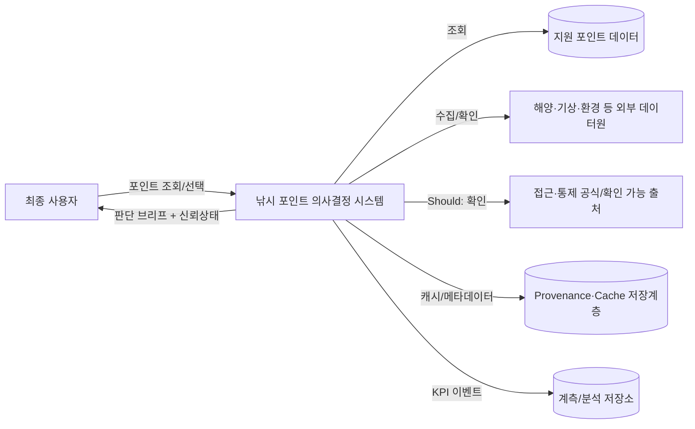
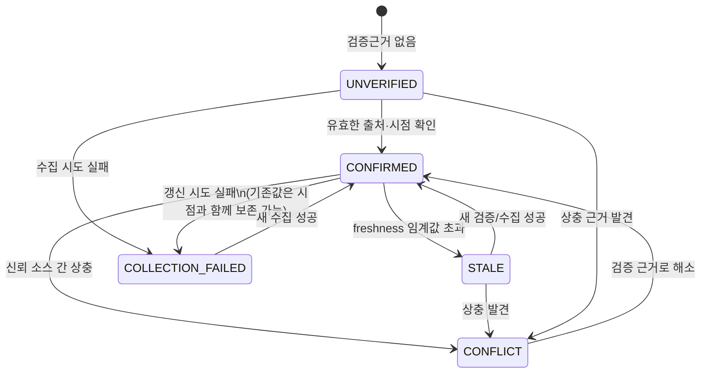
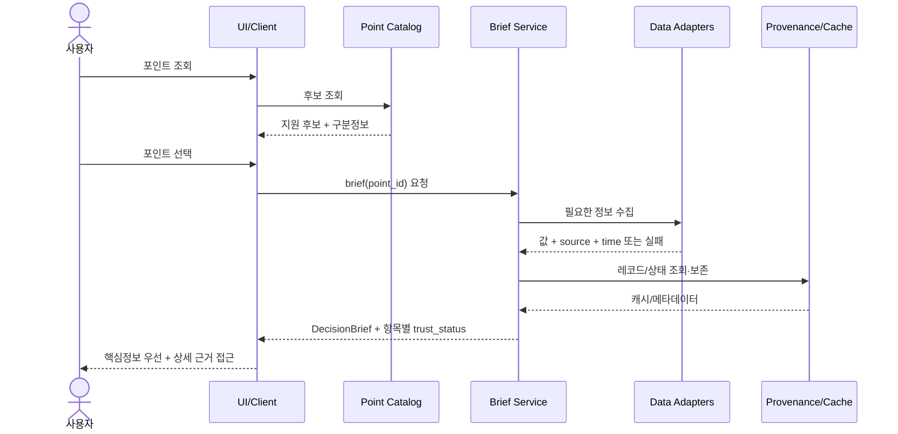
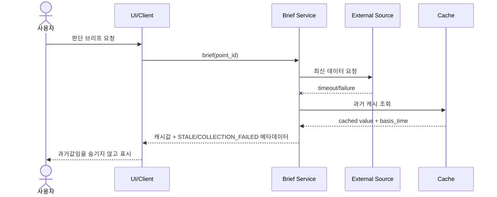
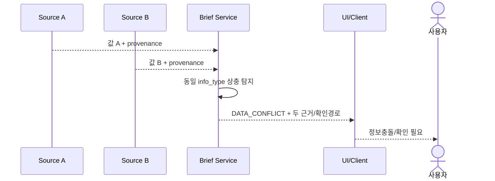

# 낚시 포인트 의사결정 서비스 SRS v1.0 승인대기본

> 상태: **Baseline Candidate / 사람 검토·승인 전**  
> 상위 제품 Source of Truth: `3주차_최종결과물.md`  
> 작성 기준: 7주차 교재 `AI로 SRS 작성·검토하고 Source of Truth로 관리하기`  
> 목적: PRD의 제품 범위를 변경하지 않고 구현·검증 가능한 Software Requirements Specification으로 변환한다.

## 0. 문서 원칙

1. PRD의 Must/Should/Out of Scope를 SRS 편의를 위해 변경하지 않는다.
2. PRD에 없는 기능·정책·기술선택을 확정하지 않는다.
3. 기능 요구사항은 독립 책임 단위로 분해하고 Acceptance Criteria와 Verification Method를 가진다.
4. 정상 흐름뿐 아니라 부분 데이터, 외부 소스 실패, 오래됨, 미확인, 정보충돌을 요구사항에 포함한다.
5. 제품 정책이 필요한 미결정은 `[결정 필요]`, 후속 범위는 `[범위 보류]`, PRD 근거가 없는 항목은 `[PRD 근거 없음]`으로 표시한다.
6. `금지 데이터 없음 ≠ 낚시 가능`을 안전 규칙으로 유지한다.
7. 본 문서는 승인 전 후보이며, 제품 정책 변경이 필요하면 PRD를 먼저 수정한다.

## 0-1. MVP 기준선

| PRD 기능 | 우선순위 | SRS 처리 |
|---|---|---|
| FR-01 포인트 조회·선택 | Must / Core Enabler | 기준선 포함 |
| FR-02 포인트 판단 브리프 | Must / Outcome-driven | 기준선 포함 |
| FR-04 정보 신뢰상태 표시 | Must / Validation-critical | 기준선 포함 |
| FR-03 후보 포인트 비교 | Should | 요구사항 정의하되 초기 구현 보류 가능 |
| FR-05 접근·통제 근거 확인 | Should | 요구사항 정의하되 초기 구현 보류 가능 |

## 01. SRS Scope & System Context v0.1

### 1. 문서 정보
- 문서: 낚시 포인트 의사결정 서비스 SRS Scope 초안
- 버전: v0.1
- 상태: Draft
- 상위 Source of Truth: `3주차_최종결과물.md`

### 2. Introduction

#### Purpose
3주차 PRD에 정의된 제품 범위를 구현·검증 가능한 소프트웨어 책임과 시스템 경계로 변환한다.

#### Product Summary
사용자가 낯선 육상 바다낚시 포인트를 선택할 때, 지원 포인트를 식별하고 판단에 필요한 정보를 한 단위로 확인하며, 각 정보의 확인 상태와 불확실성을 구분해 더 빠르고 덜 잘못된 출조 결정을 내리도록 돕는다.

#### Definitions
- 판단 브리프: 선택한 포인트의 의사결정 정보를 묶어 제시하는 논리 단위. 정확한 필드셋은 [결정 필요].
- source: 정보의 출처/제공기관/원문 근거를 식별하는 메타데이터.
- basis_time: 해당 정보가 의미하는 기준시각 또는 기준일.
- checked_at: 시스템이 해당 출처를 마지막으로 확인한 시각.
- trust_status: 확인됨/오래됨/미확인/수집실패/정보충돌 중 하나의 상태.
- 지원 포인트: MVP/POC가 식별자와 판단 데이터를 제공할 수 있도록 등록된 포인트.

### 3. Scope

#### In Scope - Must
- FR-01 포인트 조회·선택
- FR-02 포인트 판단 브리프
- FR-04 정보 신뢰상태 표시
- 부분 데이터 표시
- 외부 데이터 실패 및 캐시 상태 처리
- 정보충돌 처리
- Time-to-Decision 및 정보상태 해석 오류율 검증을 위한 계측 가능성

#### In Scope - Should / Deferred
- FR-03 2~3개 후보 포인트 비교
- FR-05 접근·통제 근거 확인

#### Out of Scope
PRD의 Won't/Out of Scope 9개 항목을 그대로 유지한다. SRS에서 기능을 재도입하지 않는다.

#### Assumptions
- 제한지역/제한 포인트셋으로 먼저 검증한다.
- 하나 이상의 외부 정보원이 일부 판단 데이터를 제공할 수 있다.
- 데이터 유형별 최신성 기준은 서로 다를 수 있다.
- 사용자 인터뷰 전이므로 Must의 고객가치 자체는 검증 전 가설이다.

#### Constraints
- 외부 데이터 누락·지연·충돌이 발생할 수 있다.
- 전국 완전 커버리지를 전제로 하지 않는다.
- 법적 `낚시 가능` 판정을 생성하지 않는다.
- 지도 중심/검색 중심 UI는 이 문서에서 고정하지 않는다.
- 구현 기술 스택은 이 문서에서 고정하지 않는다.

### 4. Stakeholders

| 이해관계자 | 역할/권한 | 책임 | 주요 관심사항 |
|---|---|---|---|
| 최종 사용자 | 포인트 조회·판단 | 최종 출조 판단 | 빠른 결정, 정보 오해 방지, 불확실성 이해 |
| 제품 담당자 | 제품 범위 승인 | PRD/SRS 범위·우선순위 관리 | JTBD, MVP 가치, KPI |
| 개발/설계 담당 | SRS 구현 | 시스템 동작·데이터 계약 구현 | 명확한 요구사항, 예외 흐름, 테스트 가능성 |
| 데이터 운영 담당 | 출처 및 상태 운영 | 데이터 수집·검증·갱신 | 출처, 최신성, 누락, 충돌, 운영비 |
| QA/검증 담당 | 요구사항 검증 | AC/NFR 시험 | 추적성, 재현 가능한 실패 시나리오 |
| 외부 데이터 제공자 | 외부 시스템 | 원천 데이터 제공 | 호출조건, 라이선스, 변경/장애 |

### 5. System Context

#### System Boundary
시스템 내부 책임:
- 지원 포인트 식별
- 판단 데이터 수집/정규화 또는 fixture 제공
- source/time/status 보존
- 판단 브리프 조립
- 신뢰상태 계산/표시용 데이터 제공
- 캐시·실패·충돌 상태 관리
- 검증용 계측 이벤트 생성

시스템 외부 책임:
- 실제 출조 여부와 최종 법적 판단
- 현장표지/일시통제의 완전 실시간 보증
- 외부 원천 데이터의 정확성 자체
- 전국 규제 완전 커버리지

### 6. Open Questions
- [결정 필요] 판단 브리프 최소 정보세트는 무엇인가?
- [결정 필요] 데이터 유형별 `오래됨` 임계값은 얼마인가?
- [결정 필요] 프로토타입/POC 초기 지원 포인트셋은 어디까지인가?
- [결정 필요] 외부 데이터 공급자와 라이선스는 무엇인가?
- [범위 보류] FR-03/FR-05를 어느 릴리스에서 활성화할 것인가?
- [Design 단계] 지도/검색/목록 중 어떤 탐색 구조를 사용할 것인가?

## 02. SRS Functional & Non-Functional Requirements v0.2

> 각 요구사항은 하나의 독립 책임만 갖고, PRD에 없는 기능을 추가하지 않는다.

### 1. 기능 요구사항

#### REQ-FUNC-POINT-001 - 지원 포인트 조회
- Requirement ID: REQ-FUNC-POINT-001
- Requirement: 시스템은 사용자가 포인트명, 지역 또는 지원 포인트 식별정보로 지원 포인트 후보를 조회할 수 있게 해야 한다.
- Priority: Must / Core Enabler
- Source: PRD FR-01, US-01, AC-01
- Input: 포인트명/지역/지원 식별자 중 사용 가능한 입력
- Preconditions: 지원 포인트 카탈로그가 로드 가능해야 한다.
- Processing Rules:
  1. 검색 결과는 지원 포인트만 판단 대상으로 열 수 있어야 한다.
  2. 검색 방식의 UI 형태는 이 요구사항에서 규정하지 않는다.
- Output: 포인트 후보 목록 또는 단일 포인트 식별 결과
- Exceptions: 결과 없음, 지원 카탈로그 조회 실패
- Acceptance Criteria:
  - Given 지원 범위 포인트가 존재할 때, When 사용자가 식별 가능한 검색값을 제공하면, Then 해당 포인트 후보를 반환한다.
- Verification Method: 기능 테스트 + fixture 기반 검색 테스트

#### REQ-FUNC-POINT-002 - 중복/유사 명칭 구분
- Requirement ID: REQ-FUNC-POINT-002
- Requirement: 시스템은 동일·유사 명칭의 포인트가 둘 이상일 때 지역·유형 등 구분 가능한 맥락을 함께 제공해야 한다.
- Priority: Must
- Source: PRD FR-01, AC-02
- Input: 동일·유사 명칭 검색결과
- Preconditions: 둘 이상의 후보가 존재한다.
- Processing Rules: 임의로 첫 후보를 자동 확정하지 않는다.
- Output: 구분정보가 포함된 후보 집합
- Exceptions: 구분정보 부족 시 식별 불가 상태
- Acceptance Criteria: 동일명 후보가 2개 이상이면 사용자가 구분 가능한 맥락 없이 단일 포인트로 자동 연결되지 않는다.
- Verification Method: 중복명 fixture 테스트

#### REQ-FUNC-POINT-003 - 미지원/식별실패 처리
- Requirement ID: REQ-FUNC-POINT-003
- Requirement: 미지원 포인트 또는 식별 불가능한 요청에 대해 시스템은 지원되지 않음을 명시하고 임의 데이터를 생성하거나 임의 매칭하지 않아야 한다.
- Priority: Must
- Source: PRD FR-01, AC-03
- Input: 미지원 또는 모호한 요청
- Preconditions: 지원대상과 정확히 연결할 수 없음
- Processing Rules: 추정 기반 포인트 생성 금지
- Output: UNSUPPORTED_POINT 또는 AMBIGUOUS_POINT 상태
- Exceptions: 없음
- Acceptance Criteria: 미지원 입력으로 판단 브리프가 생성되지 않는다.
- Verification Method: 음성 테스트/negative test

#### REQ-FUNC-BRIEF-001 - 판단 브리프 생성
- Requirement ID: REQ-FUNC-BRIEF-001
- Requirement: 시스템은 선택된 지원 포인트에 대해 현재 사용 가능한 의사결정 정보를 하나의 판단 브리프로 조립해야 한다.
- Priority: Must / Outcome-driven
- Source: PRD FR-02, US-02, AC-04
- Input: point_id, 사용 가능한 정보 레코드, 상태 메타데이터
- Preconditions: 유효한 지원 point_id가 선택됨
- Processing Rules:
  1. 브리프는 핵심 정보와 신뢰상태를 함께 제공할 수 있는 구조여야 한다.
  2. 정확한 정보 필드 목록은 [결정 필요]로 남긴다.
  3. PRD에 없는 추천점수나 자동 결론을 생성하지 않는다.
- Output: DecisionBrief
- Exceptions: 일부 데이터 누락, 전체 수집 실패
- Acceptance Criteria: 유효한 point_id에 대해 브리프 객체가 생성되며 각 정보 항목은 상태 메타데이터와 연결 가능하다.
- Verification Method: component/integration test

#### REQ-FUNC-BRIEF-002 - 부분 데이터 표시
- Requirement ID: REQ-FUNC-BRIEF-002
- Requirement: 일부 정보만 확인 가능한 경우 시스템은 확인 가능한 정보와 미확인/실패 정보를 구분한 상태로 브리프를 생성해야 한다.
- Priority: Must
- Source: PRD FR-02, AC-05
- Input: 부분 성공 데이터 집합
- Preconditions: 최소 하나 이상의 소스가 성공 또는 캐시값을 제공함
- Processing Rules: 한 소스의 실패가 모든 성공 데이터를 제거하지 않는다.
- Output: 부분 브리프 + 항목별 trust_status
- Exceptions: 브리프 최소 구성 자체가 불가능한 경우 PARTIAL_DATA 또는 DATA_UNAVAILABLE 상태
- Acceptance Criteria: 하나의 소스 실패 시 다른 성공 정보가 숨겨지지 않고 실패 항목이 별도로 표시된다.
- Verification Method: partial failure integration test

#### REQ-FUNC-BRIEF-003 - 캐시 사용 시 오래됨 공개
- Requirement ID: REQ-FUNC-BRIEF-003
- Requirement: 외부 소스 수집 실패 후 과거 캐시를 사용할 경우 시스템은 캐시의 기준시각/최근 확인일과 오래됨 또는 확인 필요 상태를 함께 제공해야 한다.
- Priority: Must
- Source: PRD FR-02 AC-06, 안정성 요구
- Input: 수집실패 + 캐시 레코드
- Preconditions: 유효한 과거 캐시 존재
- Processing Rules: 캐시를 최신값처럼 승격하지 않는다.
- Output: 캐시 데이터 + source/time/status
- Exceptions: 캐시 없음 → 수집실패/미확인만 제공
- Acceptance Criteria: 수집실패 시 과거값이 `확인됨` 최신정보로 표시되지 않는다.
- Verification Method: source outage test

#### REQ-FUNC-TRUST-001 - 신뢰 메타데이터 제공
- Requirement ID: REQ-FUNC-TRUST-001
- Requirement: 각 핵심 정보 항목은 최소한 출처, 기준시각 또는 최근 확인일, 신뢰상태를 확인할 수 있어야 한다.
- Priority: Must / Validation-critical
- Source: PRD FR-04, US-03, AC-07
- Input: 정보값 + provenance metadata
- Preconditions: 정보 항목을 사용자에게 제공함
- Processing Rules: 메타데이터는 정보값과 추적 가능하게 연결한다.
- Output: value + source + time + status
- Exceptions: source/time 중 일부를 확인할 수 없으면 trust_status를 `미확인` 또는 `확인 필요` 성격으로 낮춘다.
- Acceptance Criteria: 핵심 정보값만 있고 출처/시점/상태가 모두 없는 레코드는 정상 `확인됨`으로 노출될 수 없다.
- Verification Method: schema validation + UI/contract test

#### REQ-FUNC-TRUST-002 - 최신성 판정
- Requirement ID: REQ-FUNC-TRUST-002
- Requirement: 시스템은 데이터 유형별 최신성 기준을 적용해 임계값을 넘은 정보를 `오래됨`으로 구분해야 하며, 최신성 확인 자체가 불가능하면 `미확인/확인 필요` 상태로 처리해야 한다.
- Priority: Must
- Source: PRD FR-04, AC-08
- Input: data_type, basis_time/checked_at, freshness_policy
- Preconditions: freshness_policy가 해당 data_type에 정의됨
- Processing Rules:
  1. 임계값 숫자는 [결정 필요].
  2. freshness_policy가 미정인 데이터 유형은 임의로 `확인됨` 처리하지 않는다.
- Output: trust_status
- Exceptions: 시각 누락, 정책 누락
- Acceptance Criteria: 임계값을 초과한 fixture는 항상 STALE로 판정된다.
- Verification Method: boundary value test

#### REQ-FUNC-TRUST-003 - 정보충돌 처리
- Requirement ID: REQ-FUNC-TRUST-003
- Requirement: 신뢰 가능한 둘 이상의 소스가 동일 판단 항목에 상충하는 값을 제공하고 단일 결론을 검증할 수 없으면 시스템은 `정보충돌` 상태를 반환하고 확인 경로를 보존해야 한다.
- Priority: Must
- Source: PRD FR-04, AC-09
- Input: 상충 레코드 집합
- Preconditions: 동일 항목에 복수 신뢰 소스가 존재
- Processing Rules:
  1. 임의 우선순위로 한 값을 사실로 확정하지 않는다.
  2. 원문/출처 확인 경로를 유지한다.
- Output: CONFLICT + conflicting_records/reference
- Exceptions: 운영자가 승인한 명시적 우선규칙이 추후 생기면 SRS 변경 필요
- Acceptance Criteria: 상충 fixture 입력 시 단일 `확인됨` 값이 나오지 않는다.
- Verification Method: conflict integration test

#### REQ-FUNC-TRUST-004 - 불확실 상태 자동 승격 금지
- Requirement ID: REQ-FUNC-TRUST-004
- Requirement: `오래됨`, `미확인`, `수집실패`, `정보충돌` 상태는 검증 근거 없이 `확인됨`으로 자동 승격되어서는 안 된다.
- Priority: Must
- Source: PRD FR-04 원칙
- Input: 기존 trust_status, 신규 검증 근거
- Preconditions: 불확실 상태 존재
- Processing Rules: 상태 승격에는 새 성공 수집/검증 근거가 필요하다.
- Output: 유지 또는 근거 기반 상태 전이
- Exceptions: 없음
- Acceptance Criteria: 근거 없는 시간경과/재시작/캐시조회로 CONFIRMED가 되지 않는다.
- Verification Method: state transition test

#### REQ-FUNC-TRUST-005 - 법적 가능 추론 금지
- Requirement ID: REQ-FUNC-TRUST-005
- Requirement: 시스템은 `금지 데이터가 없음` 또는 접근·통제 정보가 없다는 이유만으로 해당 포인트를 `낚시 가능`, `문제없음`, `법적으로 가능`으로 판정해서는 안 된다.
- Priority: Must / Safety Rule
- Source: PRD FR-04 규제 원칙, Out of Scope
- Input: 규제/접근 데이터 없음 또는 불완전
- Preconditions: 공식 확인근거가 불충분함
- Processing Rules: 결측은 가능 판정의 긍정근거가 아니다.
- Output: 미확인/확인 필요 성격의 상태
- Exceptions: 추후 법적 판정 기능을 제품 범위에 추가하려면 PRD부터 수정
- Acceptance Criteria: 규제 레코드가 0개인 fixture가 `낚시 가능`으로 반환되지 않는다.
- Verification Method: safety negative test

#### REQ-FUNC-COMPARE-001 - 후보 비교
- Requirement ID: REQ-FUNC-COMPARE-001
- Requirement: Should 범위가 활성화될 경우 시스템은 2~3개 지원 포인트를 동일한 비교 기준으로 나란히 비교할 수 있게 해야 한다.
- Priority: Should
- Source: PRD FR-03
- Input: 2~3 point_id
- Preconditions: 기능 플래그/릴리스 범위에 포함
- Processing Rules: 데이터 부족을 낮은 점수로 오해하게 하지 않고 가용성/상태를 별도 표시한다.
- Output: comparable point briefs
- Exceptions: 일부 포인트 데이터 부족
- Acceptance Criteria: 동일 항목 기준으로 비교되고 결측이 점수 0처럼 표현되지 않는다.
- Verification Method: feature test

#### REQ-FUNC-ACCESS-001 - 접근·통제 근거 확인
- Requirement ID: REQ-FUNC-ACCESS-001
- Requirement: Should 범위가 활성화될 경우 시스템은 공식 또는 확인 가능한 근거가 있는 접근·통제 상태만 표시하고, 근거가 불충분하면 `확인 필요`로 처리해야 한다.
- Priority: Should
- Source: PRD FR-05
- Input: 접근·통제 근거 레코드
- Preconditions: 기능 플래그/릴리스 범위에 포함
- Processing Rules: 법적 `가능` 보증 금지
- Output: 상태 + 근거/확인경로
- Exceptions: 근거 없음/오래됨/충돌
- Acceptance Criteria: 근거 없는 상태가 확정상태로 표시되지 않는다.
- Verification Method: evidence-based test

### 2. 비기능 요구사항

#### REQ-NFR-PERF-001 - 판단 브리프 응답시간 계측
- Requirement: 시스템은 판단 브리프 첫 표시 완료시간을 수집해 p50/p95를 계산할 수 있어야 한다.
- Priority: Must for Validation
- Source: PRD 성능/KPI
- Acceptance Criteria: 테스트 세션의 브리프 요청마다 시작·첫표시 완료 이벤트가 기록되어 p50/p95 산출이 가능하다.
- Verification Method: observability test
- Note: 목표 수치는 baseline 이후 [결정 필요].

#### REQ-NFR-PERF-002 - 느린 소스의 무기한 차단 방지
- Requirement: 개별 외부 소스의 지연이 전체 브리프를 무기한 대기시키지 않아야 한다.
- Priority: Must
- Source: PRD 성능
- Processing Rules: 소스별 종료/timeout 정책을 구성 가능하게 하고, 값은 [결정 필요]로 관리한다.
- Acceptance Criteria: 의도적으로 응답하지 않는 소스가 있어도 성공한 다른 정보는 반환되고 지연 소스는 실패/미확인 상태로 종료된다.
- Verification Method: timeout/fault injection test

#### REQ-NFR-AVAIL-001 - 캐시 신선도 왜곡 금지
- Requirement: 시스템은 외부 장애 시 캐시를 최신 실시간값으로 오인시키는 상태/표현을 생성하지 않아야 한다.
- Priority: Must
- Source: PRD 안정성
- Verification Method: outage + cache test

#### REQ-NFR-OBS-001 - 데이터 소스 상태 관측
- Requirement: 시스템은 데이터 소스별 마지막 성공시각과 최근 수집 결과를 운영자가 확인할 수 있는 형태로 기록해야 한다.
- Priority: Must for POC operation
- Source: PRD 안정성/POC
- Acceptance Criteria: 각 source_id에 last_success_at과 최근 실패/성공 상태가 추적 가능하다.
- Verification Method: log/metrics inspection

#### REQ-NFR-DATA-001 - source/time/status 보존
- Requirement: 핵심 데이터 레코드는 source/provenance, 기준시각/최근 확인일, trust_status를 보존해야 한다.
- Priority: Must
- Source: PRD 데이터 최신성/불확실성
- Verification Method: schema/contract test

#### REQ-NFR-DATA-002 - 정보충돌 원본 보존
- Requirement: 충돌 발생 시 시스템은 상충하는 근거를 삭제·덮어쓰기보다 추적 가능한 형태로 보존해야 한다.
- Priority: Must
- Source: PRD 정보충돌 원칙
- Verification Method: conflict persistence test

#### REQ-NFR-PRIV-001 - 개인정보 최소수집
- Requirement: 시스템은 FR-01/02/04 핵심 흐름을 수행하는 데 필요하지 않은 개인정보를 필수 입력으로 요구하거나 저장하지 않아야 한다.
- Priority: Must
- Source: PRD 보안/개인정보
- Verification Method: data inventory review + UI/API contract inspection

#### REQ-NFR-PRIV-002 - 정확 GPS 저장 제한
- Requirement: 사용자의 정확 GPS 위치는 별도의 명시적 목적과 동의가 정의되지 않은 MVP에서는 저장하지 않아야 한다.
- Priority: Must
- Source: PRD 보안/개인정보
- Verification Method: storage/log review

#### REQ-NFR-COST-001 - 외부 데이터 비용 관측
- Requirement: POC에서 외부 소스별 호출량, 실패율, 캐시 활용량을 산출할 수 있어야 한다.
- Priority: Must for POC
- Source: PRD 비용
- Verification Method: metrics/report inspection

#### REQ-NFR-COST-002 - 전국 실시간 수집 과대설계 금지
- Requirement: MVP/POC 설계는 전국 모든 포인트의 실시간 수집을 필수 선행조건으로 두지 않아야 한다.
- Priority: Must constraint
- Source: PRD 비용/일정
- Verification Method: architecture review

### 3. 아직 수치화하지 않은 NFR
- 판단 브리프 p50/p95 목표값: [결정 필요 - baseline 후 사전등록]
- 외부 소스 timeout: [결정 필요]
- 데이터 유형별 freshness threshold: [결정 필요]
- 가용성/SLA 목표: [PRD 근거 없음 - POC 후 결정]

## 03. SRS Data · Interface · Sequence v0.3

> 이 문서는 구현 기술을 선택하는 설계서가 아니라, SRS 요구사항을 구현 준비 가능한 데이터·통신 계약·흐름으로 확장한 초안이다. 특정 DB/프레임워크/API 제공자는 고정하지 않는다.

### 1. 핵심 데이터 엔터티

#### FishingPoint
| 필드 | 타입/형식 | 상태 | 보존/규칙 |
|---|---|---|---|
| point_id | string/UUID-like | 필수 | 시스템 내 안정 식별자 |
| name | string | 필수 | 사용자 표시명 |
| region_context | string/structured | 필수 | 동일명 구분용 지역 맥락 |
| point_type | enum/string | 선택 | 방파제/항만/갯바위/연안 등. 분류체계 [결정 필요] |
| support_status | enum | 필수 | SUPPORTED/UNSUPPORTED/REVIEW_REQUIRED |
| location_ref | geospatial reference | 선택 | 구현 방식은 Design/Architecture 단계에서 결정 |

#### InformationRecord
| 필드 | 타입/형식 | 상태 | 규칙 |
|---|---|---|---|
| record_id | string | 필수 | 레코드 식별자 |
| point_id | FK-like | 필수 | FishingPoint 연결 |
| info_type | enum/string | 필수 | 정확한 판단 브리프 정보세트 [결정 필요] |
| value | typed payload | 조건부 | 수집실패/미확인 시 없을 수 있음 |
| source_id | string | 필수 또는 미확인 사유 | provenance |
| basis_time | datetime/date | 조건부 | 정보가 의미하는 기준시각 |
| checked_at | datetime | 조건부 | 마지막 확인시각 |
| fetched_at | datetime | 조건부 | 시스템 수집시각 |
| trust_status | enum | 필수 | CONFIRMED/STALE/UNVERIFIED/COLLECTION_FAILED/CONFLICT |
| source_reference | URL/reference | 조건부 | 원문 확인 경로 |

#### DataSource
| 필드 | 설명 |
|---|---|
| source_id | 출처 식별자 |
| source_name | 제공기관/서비스명 |
| source_type | official/public/commercial/manual 등 [분류 결정 필요] |
| license_or_terms | 라이선스/이용조건 메모 |
| last_success_at | 마지막 성공 수집시각 |
| last_attempt_at | 마지막 시도시각 |
| collection_status | success/failure/degraded 등 |

#### DecisionBrief
| 필드 | 설명 |
|---|---|
| brief_id | 생성 단위 식별자 |
| point_id | 판단 대상 |
| generated_at | 브리프 생성시각 |
| items | InformationRecord 참조 목록 |
| overall_data_state | 선택사항. 단일 `낚시 가능` 판정이 아니며 의미 정의 전 [결정 필요] |

> 브리프의 정확한 정보 필드와 정보 우선순위는 PRD에서 미결정이므로 SRS에서 임의 확정하지 않는다.

#### ConflictSet
| 필드 | 설명 |
|---|---|
| conflict_id | 충돌 식별자 |
| point_id | 포인트 |
| info_type | 충돌 항목 |
| record_ids | 상충 레코드 목록 |
| detected_at | 충돌 탐지시각 |
| resolution_status | unresolved/verified 등 |
| verification_path | 사용자/운영자 확인 경로 |

#### AccessControlEvidence - Should
FR-05가 활성화될 때만 사용한다. 상태, source, basis_time/checked_at, source_reference를 필수 근거로 취급하며 근거 부재를 `가능`으로 해석하지 않는다.

### 2. Trust Status 상태 규칙

규칙:
- 불확실 상태의 자동 `CONFIRMED` 승격 금지.
- 캐시 존재만으로 CONFIRMED 금지.
- 데이터 부재만으로 `낚시 가능` 결론 금지.
- freshness threshold는 data_type별 정책으로 외부화하되 실제 수치는 [결정 필요].

### 3. Logical Interface Requirements

#### IF-POINT-LOOKUP
- 목적: 사용자 입력을 지원 포인트 식별자로 연결
- Direction: Client/UI → Point Catalog
- Input: query 또는 point_id
- Authentication: [PRD 근거 없음 - MVP에서 필수 인증을 가정하지 않음]
- Success: 지원 포인트 후보 + region_context + support_status
- Failure: NO_MATCH, AMBIGUOUS, CATALOG_UNAVAILABLE
- Retry/Fallback: catalog unavailable 시 오류를 명시하고 임의 매칭 금지

#### IF-DATA-SOURCE-ADAPTER
- 목적: 외부 의사결정 데이터를 source/time/status와 함께 취득
- Direction: System → External Data Source
- Provider/Endpoint/Method: [결정 필요 / Architecture 단계]
- Input: point/location reference, requested info_type, time context
- Success: raw value + source + basis_time + fetched_at
- Failure: timeout, rate-limit, malformed, unavailable, unsupported-location
- Retry/Fallback:
  - 재시도 정책 [결정 필요]
  - 캐시 사용 시 STALE/확인 필요 상태와 시점을 함께 제공
  - 실패를 숨기지 않음

#### IF-PROVENANCE-CACHE
- 목적: 값과 출처·시점·상태를 함께 보존
- Direction: System ↔ Persistence
- Contract: InformationRecord 구조 유지
- Failure: cache unavailable → 최신값으로 오인시키지 않고 명시적 실패 처리

#### IF-ANALYTICS
- 목적: Time-to-Decision 및 상태 해석 테스트에 필요한 이벤트를 기록
- Direction: UI/System → Measurement Store
- Required events 최소안:
  - point_consideration_started
  - point_selected
  - brief_first_rendered
  - decision_completed [사용성 테스트 정의 필요]
  - trust_detail_opened
  - external_recheck_reported [프로토타입 테스트에서는 설문/관찰로 대체 가능]
- 개인 식별자: 핵심 검증에 불필요한 개인정보를 이벤트에 넣지 않는다.

### 4. 공통 논리 오류 코드

| 코드 | 의미 | 사용자/시스템 처리 원칙 |
|---|---|---|
| POINT_UNSUPPORTED | 미지원 포인트 | 임의 데이터 생성 금지 |
| POINT_AMBIGUOUS | 포인트 식별 모호 | 구분정보 요구 |
| SOURCE_TIMEOUT | 외부 소스 시간초과 | 다른 성공데이터 우선 표시, 해당 항목 실패상태 |
| SOURCE_UNAVAILABLE | 외부 소스 장애 | 캐시 있으면 시점·오래됨 공개 |
| DATA_UNVERIFIED | 검증근거 부족 | 미확인으로 표시 |
| DATA_STALE | 최신성 임계 초과 | 오래됨으로 표시 |
| DATA_CONFLICT | 신뢰 소스 상충 | 단일 결론 금지, 확인경로 제공 |
| DATA_PARTIAL | 일부 항목 미가용 | 부분 브리프 허용 |

> HTTP status, REST/GraphQL, endpoint path는 기술 선택 전이므로 고정하지 않는다.

### 5. 핵심 Sequence

#### 5.1 정상 흐름 - 포인트 선택 → 판단 브리프

#### 5.2 실패 흐름 - 일부 소스 실패 + 캐시 존재

#### 5.3 실패 흐름 - 신뢰 소스 충돌

### 6. Open Questions
- 실제 외부 데이터 공급자/엔드포인트/호출조건
- 판단 브리프 최소 정보세트
- freshness threshold per info_type
- source 신뢰도/우선순위 정책이 필요한지 여부
- timeout/retry/backoff 수치
- POC 저장소의 보존기간
- analytics의 `decision_completed` 판단 방식

## 04. SRS Review

> 검토 대상: Scope v0.1 + Requirements v0.2 + Data/Interface/Sequence v0.3
> 관점: 7주차 교재의 자동 검토 + 사람 검토 기준

### 1. 자동 검토 결과

| 심각도 | Requirement ID/위치 | 문제 | 근거 | 영향 | 수정 제안 |
|---|---|---|---|---|---|
| Major | REQ-FUNC-BRIEF-001 | 판단 브리프 최소 정보세트가 미결정 | PRD 남은 불확실성 6 | 실제 화면/데이터 계약 확정 불가 | 사용자 인터뷰/프로토타입 전에 최소 정보세트 가설을 별도 승인 |
| Major | REQ-FUNC-TRUST-002 | 데이터 유형별 freshness threshold 미결정 | PRD SRS 진입 주의사항 | STALE 경계 테스트 수치 확정 불가 | data_type별 임계값 표를 POC 전 승인 |
| Major | KPI/NFR | p50/p95 성공 목표 수치 미결정 | PRD는 baseline 후 사전등록 | 제품 성공 판정 자동화 불가 | baseline 측정 후 목표값을 PRD 승인→SRS 반영 |
| Major | External Interfaces | 실제 데이터 공급자·계약·라이선스 미확정 | PRD 의존성/비용 | POC 구현 계획 확정 불가 | 제한지역 후보 소스 조사 후 Architecture/ADR 및 SRS interface 갱신 |
| Minor | System Context | 지도/검색/목록 탐색 방식 미정 | PRD 최종 주의사항 | UI 설계만 지연 | SRS에서 고정하지 않고 Design Specification으로 이관 - 현재 처리 적절 |
| Minor | FR-03/FR-05 | Should 요구사항의 릴리스 활성시점 미정 | PRD Should | 초기 구현량 변동 가능 | MVP 구현은 feature-deferred로 표시, 승격은 PRD 승인 필요 |
| Minor | Retention | cache/provenance 보존기간 미정 | PRD 근거 없음 | 운영비/감사 추적 영향 | POC 규모 확정 후 운영정책 결정 |

#### Critical 결함
현재 PRD 범위를 왜곡하거나 안전원칙을 위반하는 Critical 결함은 발견하지 않았다.

### 2. PRD 역추적 검토
- Must FR-01/02/04가 SRS에서 누락되지 않음.
- Should FR-03/05가 Must로 자동 승격되지 않음.
- Out of Scope 9개 항목이 신규 기능으로 유입되지 않음.
- `금지 데이터 없음 ≠ 낚시 가능` 규칙 유지.
- 외부 수집 실패와 과거 캐시를 최신값처럼 취급하지 않음.
- 정보충돌 시 단일 결론을 임의 생성하지 않음.
- 정확 GPS/불필요 개인정보 수집을 MVP 필수로 만들지 않음.

### 3. 사람의 검토 기준 적용

#### 제품 가치
- Keep: REQ-FUNC-POINT-001~003, BRIEF-001~003, TRUST-001~005
- 이유: FR-01/02/04의 Must 가치가설과 직접 연결됨.
- Defer: COMPARE-001, ACCESS-001
- 이유: PRD에서 Should이며 수동 우회/가치 검증 필요.

#### 구현 난이도
- MVP/프로토타입은 제한 포인트셋 + fixture/mock source로 먼저 검증 가능.
- 실제 외부 source adapter와 freshness 운영은 제한지역 POC에서 확장.
- 전국 실시간 파이프라인을 선행하지 않음.

#### 운영 가능성
- source/time/status와 last_success_at을 운영 핵심 메타데이터로 유지.
- 수집실패, stale, conflict를 운영자가 추적할 수 있어야 함.
- FR-05는 운영비가 큰 영역이므로 Should 유지.

#### 비용 효율성
- 고가 API를 핵심 가치의 선행조건으로 두지 않음.
- 외부 소스별 호출량·실패율·캐시활용량 계측 후 선택.
- 수동/더미 데이터로 제품가치 검증이 가능한 단계는 먼저 그렇게 수행 가능.

#### 검증 가능성
- 기능 요구사항은 Given/When/Then 또는 상태전이 테스트로 검증 가능.
- 수치가 미정인 NFR은 현재 `결정 필요`로 남아 있으며 구현 baseline 전에 확정 필요.

### 4. MVP 범위 조정표

| Requirement | 판정 | 이유 |
|---|---|---|
| REQ-FUNC-POINT-001~003 | 유지 | 핵심 흐름 Enabler |
| REQ-FUNC-BRIEF-001~003 | 유지 | DO1-R 검증 |
| REQ-FUNC-TRUST-001~005 | 유지 | DO6-R + 안전/오해 방지 |
| REQ-FUNC-COMPARE-001 | 이동/보류 | Should, 단일 포인트 확인으로 우회 가능 |
| REQ-FUNC-ACCESS-001 | 이동/보류 | Should, 반복 Pain 및 운영가능성 미검증 |
| 전국 실시간 수집 | 삭제/금지 | PRD Out of Scope/과대설계 방지 |
| 자동 추천/조과예측 AI | 삭제/금지 | PRD Out of Scope |

> 제품 정책 변경은 하지 않았다. FR-03/05의 Should 상태는 PRD 그대로 유지한다.

### 5. 승인 전 반드시 확인할 항목
1. [결정 필요] 판단 브리프 최소 정보세트
2. [결정 필요] data_type별 freshness threshold
3. [결정 필요] POC 지원 포인트셋
4. [결정 필요] 외부 데이터 공급자/이용조건
5. [결정 필요] KPI 목표 수치 - baseline 후 PRD 승인 필요
6. [Design 단계] 지도/검색/목록 UI 구조

### 6. 검토 결론
SRS 구조와 핵심 규칙은 PRD와 정합하며 **통합 검토본으로 진행 가능**하다. 다만 위 5개 `결정 필요` 항목 중 1~4는 실제 외부데이터 기반 POC/구현 계획 확정 전에 반드시 승인되어야 한다. KPI 목표 수치는 baseline 측정 후 제품정책으로 먼저 PRD에 반영한 뒤 SRS에 내려오는 순서를 따른다.
## 5. Traceability Matrix 초안

| PRD Source | SRS Requirement | Test Case ID | 검증 개요 |
|---|---|---|---|
| FR-01 / AC-01 | REQ-FUNC-POINT-001 | TC-POINT-001 | 지원 포인트 조회·선택 |
| FR-01 / AC-02 | REQ-FUNC-POINT-002 | TC-POINT-002 | 동일·유사 명칭 구분 |
| FR-01 / AC-03 | REQ-FUNC-POINT-003 | TC-POINT-003 | 미지원/식별실패 시 임의 매칭 금지 |
| FR-02 / AC-04 | REQ-FUNC-BRIEF-001 | TC-BRIEF-001 | 유효 포인트의 판단 브리프 생성 |
| FR-02 / AC-05 | REQ-FUNC-BRIEF-002 | TC-BRIEF-002 | 부분 데이터와 미확인 분리 |
| FR-02 / AC-06 | REQ-FUNC-BRIEF-003, REQ-NFR-AVAIL-001 | TC-BRIEF-003 | 소스 실패 + 캐시 사용 시 시점/오래됨 공개 |
| FR-04 / AC-07 | REQ-FUNC-TRUST-001, REQ-NFR-DATA-001 | TC-TRUST-001 | source/time/status 확인 가능 |
| FR-04 / AC-08 | REQ-FUNC-TRUST-002 | TC-TRUST-002 | freshness 임계 경계 테스트 |
| FR-04 / AC-09 | REQ-FUNC-TRUST-003, REQ-NFR-DATA-002 | TC-TRUST-003 | 충돌 시 단일 결론 금지 |
| FR-04 원칙 | REQ-FUNC-TRUST-004 | TC-TRUST-004 | 불확실 상태 자동 승격 금지 |
| FR-04 규제 원칙 | REQ-FUNC-TRUST-005 | TC-TRUST-005 | 데이터 부재를 가능으로 추론 금지 |
| FR-03 | REQ-FUNC-COMPARE-001 | TC-COMPARE-001 | 2~3개 포인트 동일기준 비교 - Should |
| FR-05 | REQ-FUNC-ACCESS-001 | TC-ACCESS-001 | 근거 있는 접근·통제만 표시 - Should |
| 성능 | REQ-NFR-PERF-001 | TC-NFR-PERF-001 | 브리프 p50/p95 계측 가능 |
| 성능/안정성 | REQ-NFR-PERF-002 | TC-NFR-PERF-002 | 느린 소스가 전체 무기한 차단하지 않음 |
| 안정성 | REQ-NFR-OBS-001 | TC-NFR-OBS-001 | source별 마지막 성공시각 추적 |
| 개인정보 | REQ-NFR-PRIV-001~002 | TC-NFR-PRIV-001 | 불필요 개인정보/정확 GPS 저장 점검 |
| 비용 | REQ-NFR-COST-001~002 | TC-NFR-COST-001 | 호출량·캐시량 계측 및 전국 과대설계 부재 검토 |

> 실제 Test Case 본문은 Tasks/Test 단계에서 작성하되 Requirement ID를 변경하지 않는다.

## 6. Test Case Skeleton

### TC-POINT-003 - 미지원 포인트
- Given: 지원 카탈로그에 없는 포인트명
- When: 상세 판단 요청
- Then: `POINT_UNSUPPORTED` 또는 동등한 미지원 상태를 반환하며 임의 포인트/판단데이터를 생성하지 않는다.

### TC-BRIEF-003 - 수집 실패 + 과거 캐시
- Given: 외부 소스가 실패하고 과거 캐시가 존재함
- When: 판단 브리프 생성
- Then: 캐시값을 제공할 수 있으나 기준시각과 `STALE` 또는 실패 관련 상태가 함께 제공되고 최신 `CONFIRMED`로 표시되지 않는다.

### TC-TRUST-003 - 정보충돌
- Given: 동일 info_type에 대해 신뢰 가능한 Source A와 B가 서로 다른 값을 제공함
- When: 단일 결론을 검증할 추가 근거가 없음
- Then: `CONFLICT`와 확인 경로를 제공하며 A 또는 B를 임의로 확정하지 않는다.

### TC-TRUST-005 - 규제 데이터 부재
- Given: 특정 포인트의 금지/접근 데이터가 수집되지 않음
- When: 사용자가 상태를 확인함
- Then: `낚시 가능` 또는 `문제없음`으로 판정하지 않고 `미확인/확인 필요` 성격의 상태를 제공한다.

## 7. Source of Truth 운영 규칙

| 정보 영역 | Source of Truth |
|---|---|
| 고객 문제·가치 제안·JTBD | VPS/제품전략 문서 및 승인된 PRD 근거 |
| 제품 기능·MVP 범위·우선순위 | **PRD (`3주차_최종결과물.md`)** |
| 소프트웨어 동작·예외·NFR·데이터/인터페이스 계약 | **본 SRS** |
| 화면·인터랙션·컴포넌트 상세 | Design Specification |
| 기술 선택·아키텍처 결정 이유 | Architecture 문서 / ADR |
| 개발 작업 상태 | GitHub Issues/Project 등 작업관리 시스템 |
| 구현 결과 | Git Repository |
| 자동 테스트 결과 | CI 테스트 리포트 |
| 배포 상태 | 배포 플랫폼/대시보드 |

### 충돌 처리 원칙
1. 제품 정책·MVP 범위가 바뀌어야 하면 **PRD를 먼저 수정·승인**한다.
2. PRD 변경이 승인되면 SRS를 갱신한다.
3. SRS 변경 후 관련 Design/Task/Test를 갱신한다.
4. 제품 범위를 바꾸지 않는 소프트웨어 동작 보완은 SRS에서 처리한다.
5. 구현 세부 선택은 Architecture/ADR에 기록하고, SRS의 외부 계약이나 동작을 바꾸면 SRS도 갱신한다.
6. 외부 서비스의 API 계약 변화로 시스템 동작 계약이 바뀌면 SRS Interface Requirement를 갱신한다.

## 8. Requirement Baseline 및 버전 규칙
- 현재 버전: v1.0 **승인대기본**
- 승인 전: Requirement ID 유지, 내용 변경 가능
- 승인 후: Requirement ID를 재사용해 의미를 바꾸지 않는다. 폐기 요구사항은 Deprecated/Removed 이력을 남긴다.
- 기능 범위 변경은 PRD 승인 없이 SRS에서 독자적으로 수행하지 않는다.
- `[결정 필요]` 항목이 실제 구현·테스트를 차단하는 시점에는 Open Question으로 방치하지 않고 승인 기록과 함께 해소한다.

## 9. Baseline 승인 전 Open Decisions

| ID | 항목 | 현재 상태 | 승인 주체/선행조건 |
|---|---|---|---|
| OD-01 | 판단 브리프 최소 정보세트 | 결정 필요 | 제품 담당 + 프로토타입 가설 |
| OD-02 | 데이터 유형별 freshness threshold | 결정 필요 | 데이터 특성/POC 근거 |
| OD-03 | 초기 지원 포인트셋 | 결정 필요 | POC 운영 범위 |
| OD-04 | 외부 데이터 공급자/API/라이선스 | 결정 필요 | 데이터 조사 + 비용/약관 확인 |
| OD-05 | KPI 정량 목표 | 결정 필요 | baseline 측정 후 PRD 승인 |
| OD-06 | 지도/검색/목록 UI 구조 | Design 단계 | 사용자 흐름/프로토타입 검증 |
| OD-07 | FR-03/FR-05 활성 릴리스 | 범위 보류 | PRD Should 유지, 검증 결과 |

## 10. 최종 기준선 문장

> 이 SRS는 ‘낚시 정보를 많이 보여주는 시스템’을 정의하지 않는다. **지원 포인트를 식별하고, 현재 사용 가능한 의사결정 정보를 신뢰상태와 함께 제공하며, 불확실하거나 충돌하는 정보를 확정사실처럼 승격하지 않는 시스템 동작**을 정의한다. 제품 범위는 PRD의 Must/Should를 그대로 따른다.

## v1.1 승인 델타 (2026-09-16)

사용자 승인으로 기존 ID를 변경하지 않고 다음 Must를 추가한다.

- `REQ-FUNC-OFFICIAL-001`: 명시 선택한 공식 지원 포인트에서만 국립해양조사원 공식 어종별
  지수·점수·예측시각과 실제 제공 환경 필드를 표시한다.
- `REQ-FUNC-OFFICIAL-002`: 공식 등급/점수와 TrustStatus를 독립적으로 표시한다.
- `REQ-FUNC-OFFICIAL-003`: 미지원·누락·timeout/error·stale cache를 실제값으로 위장하지 않는다.
- `REQ-FUNC-OFFICIAL-004`: MVP는 `OFFICIAL_FISHING_INDEX`만 생성하고 자체 어종평가를 만들지 않는다.
- `REQ-FUNC-LOCATION-001`: 사용자 행동 후 GPS를 요청하고 거리 후보를 보여주되 명시 선택 전
  공식 포인트를 확정하지 않는다.
- `REQ-FUNC-LOCATION-002`: 권한 거부·기능 불가·후보 없음에도 직접 검색을 유지한다.
- `REQ-NFR-SEC-001`: provider key를 client/repository/URL에 노출하지 않고 server secret 경계를 사용한다.
- `REQ-NFR-PRIV-003`: raw GPS를 영구저장·로그·analytics에 남기지 않는다.
- `REQ-NFR-DATA-003`: 공식 응답을 검증하고 source/time/status 및 관측별 provenance를 보존한다.

공식 API 필드와 운영 경계는 `contracts/official-fishing-index.md`가 추적한다. Live proxy 공급자,
service key 등록과 운영 freshness 수치는 승인 전 TBD이며 데모 결과와 live 결과를 혼합하지 않는다.
